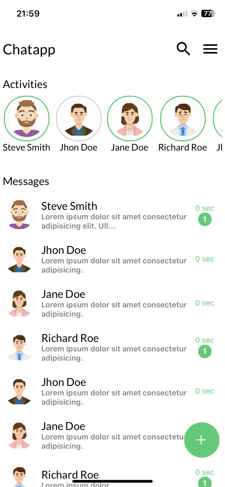
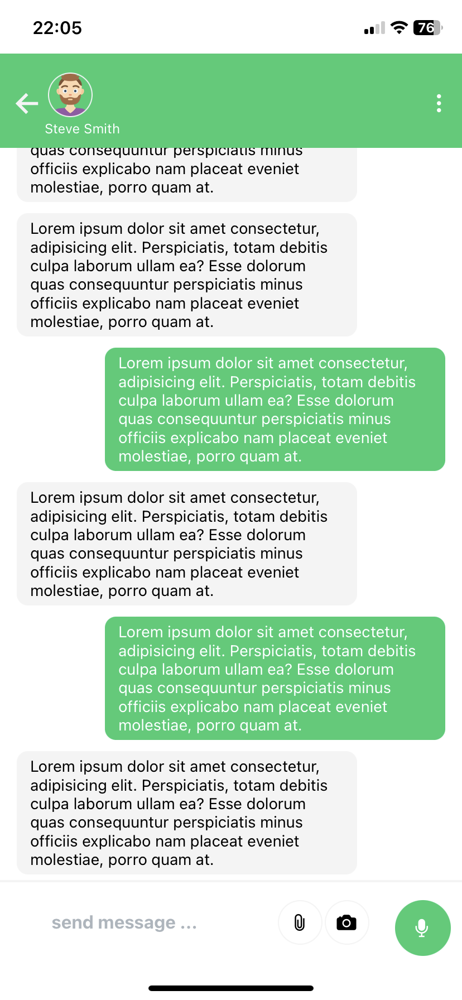
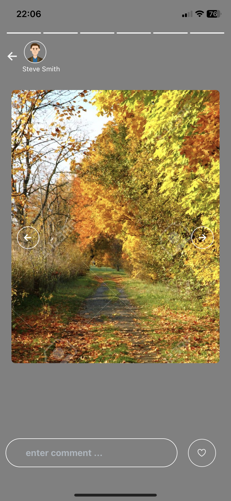

# ChatApp

## Convertations Screen

![Convertations Screen]

## Chat Screen

![Chat Screen]

## Activity Screen

![Activity Screen]

# Getting Started

To get started with the app, follow these steps:

1. Clone the repository: `git clone https://github.com/Ayman-shaim1/mobile-chatapp`
2. Install dependencies: `npm install`
3. Run the app: `expo start`

Please note that this app requires Node.js and Expo cli to be installed on your development machine.
